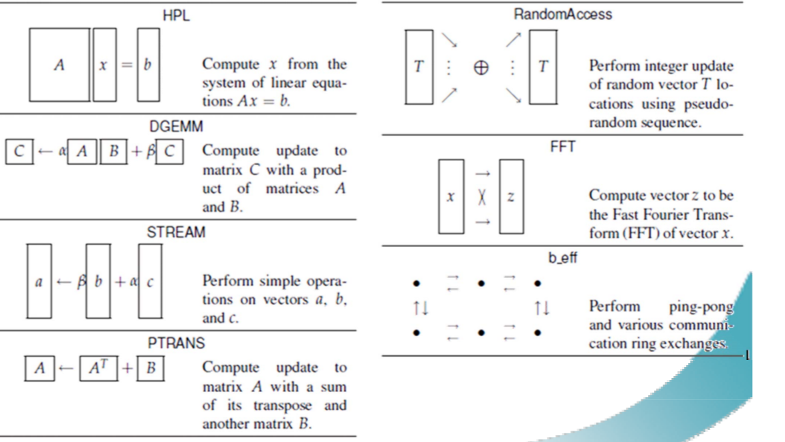

# HPCC 从入门到放弃系列
这学期的课上的差不多了。我发现并行计算这个方向课的老师真喜欢让学生优化 HPCC。
可是HPCC只有稠密线性代数问题。也没有稀疏问题，比如HPCG，感觉学不到好东西啊。。
另外，感觉找不到什么中文资料啊，官网上面的资料都是单核CPU时代的，已经落伍了。
所以从0起步，做起来很麻烦，影响科研和学习。
于是我产生了一个idea，如果来个连载HPC challenge的优化，这样大家可以轻松找到代码和资料。
这样HPC Challenge的技术慢慢烂大街，这样老师就只能教更先进的技术了。比如大作业改成优化HPCG这样的稀疏问题。
怎么想都觉得是个好主意。所以HPCC系列的连载随便转发，也许能改变一下教学，特别是不喜欢写实验报告的同学。。(比如我。。。HPCC还有7个测试，报告得写多少字啊。。呜呼哀哉！可是我真的只想学点更先进的。。)
目前打算这样安排
- S01 主要写算法和源代码的分析
- S02 主要写single部分的优化（单进程测试）
- S03 主要写star部分的优化（完全并行，即系统中的处理器都要运行测试程序的计算任务, 但彼此间没有通信。）
- S04 主要写mpi部分，也就是并行部分的优化。
- S05 我也不知到写什么，到时候再说吧。

也不一定按季更新，更新什么，看我的技术水平。。反正存货一下子也写不完啦。
## 什么是HPCC
　　HPCC 全称 HPC Chanllenge Benchmark
　　Benchmark 是指一组用来评估硬件或者软件相关性能的基准测试程序
　　HPC Chanllenge Benchmark 由一组benchmark组成，共计7个，分别测试了系统7个方面的性能，这7个分别为：[1]

HPCC测试包含7个部分
HPL:并行LU分解求解线性方程组
DGEMM:稠密矩阵乘稠密矩阵
STREAM:blas Level1 $a=\beta b+\alpha c$
PTRANS: 稠密矩阵并行转置
RandomAccess:随机更新数组中的元素
FFT:并行和串行的快速傅里叶变换
b_eff:乒乓测试，测进程间通信带宽。

HPCC有三种加载测试方法，
•	Local:局部计算，单个处理器完成的计算。
•	Embarrassingly Parallel：完全并行，即系统中的处理器都要运行测试程序的计算任务, 但彼此间没有通信。
•	Global：全局计算，整个系统中的所有处理器并行执行计算任务，彼此间有显式通信。

最后的指标，会有这3个部分。比如
SingleFFT_GFLOPS 就是单进程的FFT峰值性能(Rmax)
StarFFT_GFLOPS 就是多进程，每个进程跑一个FFT的峰值性能(Rmax)
MPIFFT_GFLOPS 就是多进程，大家一起跑FFT的峰值性能(Rmax)
在多核机时代，Star的指标一般要比Single差，因为多核共享硬件资源，所以测Star性能会差一点。
但是Star没有进程间通信。
首先会更新第一季。
以后代码和文章放这里 https://github.com/chenlin0/HPCC
(如果更新仓库太大了，再去gitee上开一个，下载速度快一点。)
P.S. 如果老师上HPCC的优化课，大家应该会去github上搜一搜，会上知乎上搜吗?gitee呢? 希望能帮助到大家吧。我第一次课被K.O. 应该不会有比我惨的。。。(只打算写中文，英文资料那么丰富的说。。)
## 参考文献
[1] enjoyhot.HPC性能测试. https://www.it610.com/article/1280305152368066560.htm
